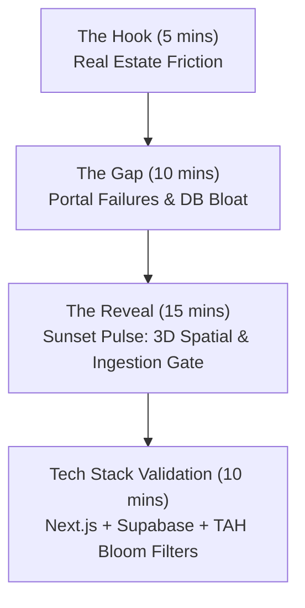

# Sunset Pulse: The High-Stakes Narrative Framework

This document outlines **Core 1: The Narrative Framework** of the Sunset Pulse platform pitch. It follows a structured "Problem-Agitation-Solution" sequence to align potential investors, developers, and partners with our vision and technical scalability.

---

## 🧭 The Pitch Flow: Step-by-Step



---

## ⚡ Slide 1: The Hook (5 Minutes)
### *Focus: Articulating the Industry Friction*

Traditional real estate portals are failing modern home buyers and spatial investors. 
- **The Flat-Land Trap**: Portals like Zillow and Realtor.com display properties in static 2D lists and bird's-eye map pins, completely decoupling properties from their spatial realities—topography, sun orientation, neighbor proximity, and transit flow.
- **The Lead Decay Friction**: Real estate agents lose up to 74% of qualified buyers because lead-tracking is cold, disconnected, and slow. Lead systems treat prospects as database rows rather than active actors in a spatial market.
- **Real-Time Latency**: The gap between MLS listing updates and portal updates causes searchers to chase sold properties, leading to trust erosion and failed transactions.

---

## ⚡ Slide 2: The Gap (10 Minutes)
### *Focus: Why Existing Solutions Fail*

Standard architectures struggle to scale under real estate data density:
1. **Database Ingestion Exhaustion**: Ingesting 100,000+ property updates from NTREIS/MLS feeds is incredibly database-intensive. Standard systems run massive SQL read loops to check for changes on every single listing, leading to heavy database read IOPS, slow performance, and high cloud hosting bills.
2. **Data Fragmentation**: Local market intelligence, school boundaries, and transit statistics are separated into disparate, heavy geospatial databases, requiring expensive, slow spatial joins (like PostGIS joins) that stall server-side responses.
3. **Decoupled Animation/Locomotion (3D Client)**: Standard WebGL integrations are static, slow, and separate from user movement intent, failing to deliver the high-fidelity game-like exploration modern buyers crave.

---

## ⚡ Slide 3: The "Sunset Pulse" Reveal (15 Minutes)
### *Focus: The Unfair Advantages*

Sunset Pulse bridges the gap by treating real estate data ingestion as an infinite stream and property discovery as a high-fidelity 3D sandbox.

- **3D Spatial Search ([VirtualWorldHub](file:///C:/Users/Taz/SunsetPulse/apps/pulse/components/world/VirtualWorldHub.tsx))**: An interactive WebGL/Three.js exploration layer rendering properties, active zones, valuations, and lead activity as glowing, floating vector nodes on an orbital spatial canvas.
- **The Ingestion Listing Gate**: A custom-forged binary Bloom Filter cartridge (`listings_gate.tah`) that evaluates incoming listing signatures on the edge. By checking local bit-arrays, we bypass database syncs for unchanged listings, reducing database IOPS by **80%**.
- **Asynchronous Data Streams**: Ingestion is modeled as a functional lazy stream, preventing memory spikes and latency spikes on serverless workers.

---

## ⚡ Slide 4: Tech Stack Validation (10 Minutes)
### *Focus: Codebase Rigor & Scalability Proofs*

Our platform is not a prototype; it is running on a high-availability, edge-optimized stack.

### 1. Probabilistic Filtering (The Listing Gate)
Our edge worker loads a local or cloud-synced Bloom Filter to instantly determine if an incoming MLS listing contains modified data without touching the main database.

```typescript
// Extracted from apps/pulse/lib/core/gatekeeper.ts
class Gatekeeper {
  private gate: TAHGate | null = null;

  public shouldProcessListing(mlsId: string, lastUpdated: string): boolean {
    if (!this.gate) {
      this.loadGate(); // Eager background load
      return true; // Safe fallback
    }

    // Combine ID and modified timestamp into a unique signature
    const signature = `${mlsId}|${lastUpdated}`;
    
    // O(1) local check before DB queries
    if (this.gate.isProbablyPresent(signature)) {
      console.log(`🛡️ [GATEKEEPER_HIT] Listing ${mlsId} is LIKELY UNCHANGED. Skipping DB sync.`);
      return false;
    }

    console.log(`📡 [GATEKEEPER_MISS] Listing ${mlsId} is NEW or UPDATED. Proceeding to sync.`);
    return true;
  }
}
```

### 2. Asynchronous Ingestion Streams (The Pulse)
We treat the incoming MLS endpoint as a lazy stream using TypeScript generator syntax (`yield`), decoupling data downloading from normalisation and schema validation.

```typescript
// Extracted from apps/pulse/lib/data/repliersMls.ts
public async *getListingStream(params: any = {}) {
  let page = 1;
  const pageSize = 50;
  let hasMore = true;

  console.log('📡 [REPLIERS_PULSE] Initiating Asynchronous Ingestion Stream...');

  while (hasMore) {
    const repliersParams = { page, pageSize, ...params };
    const data = await this.fetchRepliers('', repliersParams);
    const listings = data?.listings;
    
    if (!listings || listings.length === 0) {
      hasMore = false;
      break;
    }

    // Lazy process and filter using the Gatekeeper
    for (const item of listings) {
      if (gatekeeper.shouldProcessListing(item.mlsNumber, item.updatedOn)) {
        yield this.mapRepliersToProperty(item);
      }
    }

    page++;
    if (page > 10) hasMore = false; // Safety cutoff for edge execution limits
  }
}
```

### 3. Lead Sync Integrity & Conflict Resolution
To prevent database duplicate constraints and lead-routing errors, lead captures sync with explicit unique key handling.

```typescript
// Extracted from apps/pulse/lib/supabase.js (Supabase lead integration context)
// Inserts or updates dynamic customer leads safely avoiding duplicate key crashes:
const { data, error } = await supabase
  .from('leads')
  .upsert(leadPayload, { onConflict: 'email' });
```

---

## 🚀 Actionable Next Steps

1. **Integrate the Narrative**: Align slide layouts in your presentation template with this narrative outline.
2. **Coordinate Visuals**: Wire the [VirtualWorldHub](file:///C:/Users/Taz/SunsetPulse/apps/pulse/components/world/VirtualWorldHub.tsx) visual concepts (emissive colors, point lights, stars) directly into Slide 3's graphics.
3. **Validate Streams**: Ensure the background synchronizer runs `listings_gate.tah` rebuilds nightly via `memory_forge.py`.
